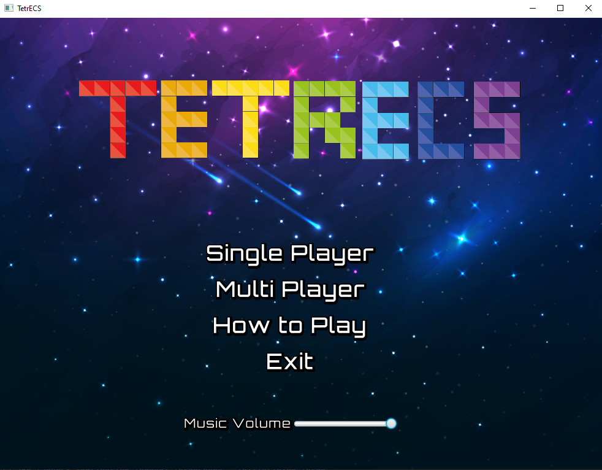
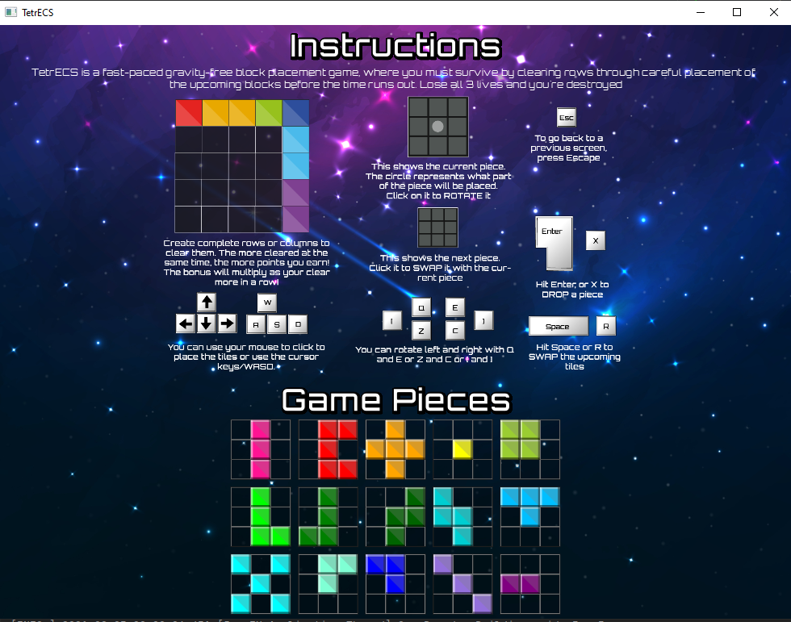
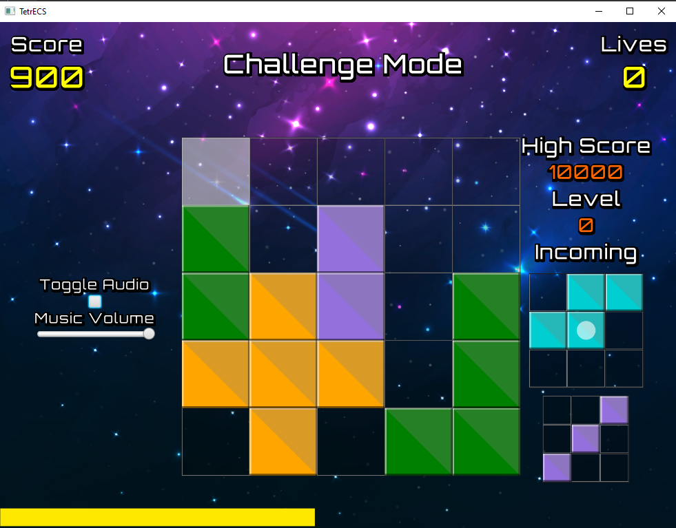
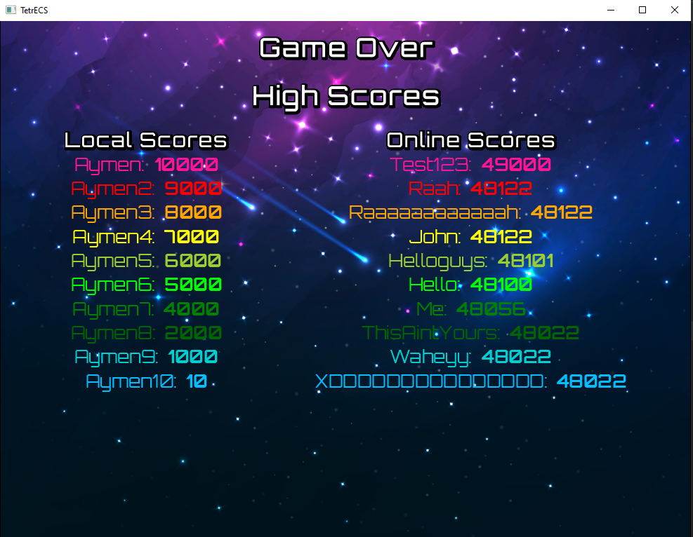

# TETRECS
This project is a fast paced block placement game (based on tetris). Compete to achieve new local and online high scores!
 
## Table of Contents
* [Video](#video)
* [General Info](#general-information)
* [Technologies Used](#technologies-used)
* [Setup](#setup)
* [Usage](#usage)
* [Project Status](#project-status)
* [Room for Improvement](#room-for-improvement)
* [Screen Shots](#screen-shots)
* [Acknowledgements](#acknowledgements)

## Video

https://user-images.githubusercontent.com/76476479/128232986-7d87e45a-c079-4bf4-872c-b78b195ddb51.mp4

## General Information
### Skills developed as a result of this project:
- JavaFX
- Using Maven for build automation
- Creating and using custom components
- Graphics and animation
- Listeners, properties and binding
- Communications
- Media
- Files     

 ### Mechanics of the game:
- You have a 5x5 grid.
- You score by clearing lines, horizontally or vertically.
- You can rotate pieces.
- You can store a single piece to come back to later.
- The more lines you clear in one go, the more points you get.
- Every piece that you play that clears at least one line increases your score multiplier.
- As your score goes up, so does your level, and you get less time to think.
- If you fail to place a block, you lose a life.
- Lose 3 lives, and the game ends.

- The game is fully playable using only keyboard inputs.

## Technologies Used
- Java
- JavaFX
- Maven
- Command line

## Setup
[Apache Maven](https://maven.apache.org/install.html) will need to be installed in order to play the game.

## Usage
Use these commands to start the game:

- mvn clean
- mvn compile
- javafx:run

## Project Status
Project is: _complete_

## Room for Improvement

Room for improvement:
- Add multiplayer mode.
- Add a hover effect showing where the piece will be placed. 
- Create customisable UIs, for example letting the user chose what music they want.
- Add statistics to the score section, add the ability to save and retrieve them between games.

## Screen Shots

  

  

  

## Acknowledgements
- This project was inspired by [The Electronics and Computer Science department at The University Of Southampton](https://www.ecs.soton.ac.uk/).
